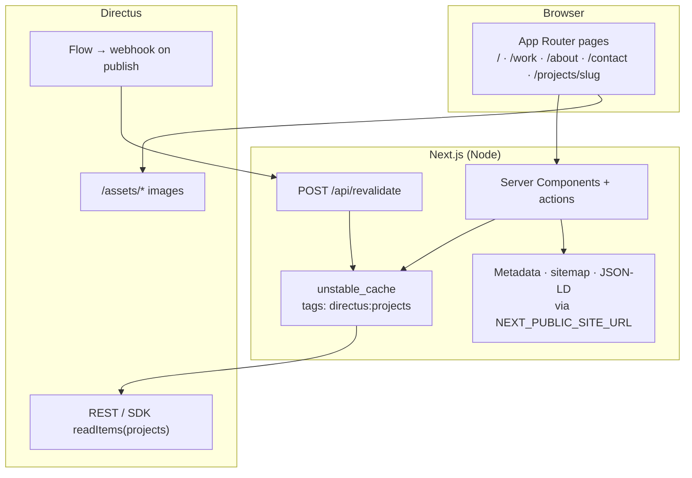

# TheoCodes.dev — portfolio (2026)

Personal portfolio and case studies for **[Theodore Belo](https://theocodes.dev)**.

| | |
|---|---|
| **Live site** | [https://theocodes.dev](https://theocodes.dev) |
| **LinkedIn** | [linkedin.com/in/theodore-belo](https://www.linkedin.com/in/theodore-belo) |
| **CMS** | [admin.theocodes.dev](https://admin.theocodes.dev) (Directus) |
| **Stack** | Next.js 16 · React 19 · TypeScript · Directus · Tailwind CSS · Framer Motion |

## Architecture



**Request path:** Route handlers and server components call cached actions in [`lib/actions/projects.actions.ts`](./lib/actions/projects.actions.ts). Those wrap Directus reads with TTL and cache tags defined in [`lib/cms-cache.ts`](./lib/cms-cache.ts). After you publish in Directus, an HTTP Flow hits [`/api/revalidate`](./app/api/revalidate/route.ts) so the next visitor sees updated work without redeploying.

**Canonical URLs:** [`lib/site.ts`](./lib/site.ts) reads `NEXT_PUBLIC_SITE_URL` (default `https://theocodes.dev`) for `metadataBase`, sitemap, robots, and structured data. Social links default from the same module via [`lib/constants`](./lib/constants/index.ts).

See [ADR 001 — CMS cache and revalidation](docs/adr/001-cms-cache-and-revalidation.md) for why TTL + tags + webhooks were chosen over route-only `revalidate`.

## Why Directus?

- **Content vs code** — Case study copy, tags, featured flags, and images change often; they belong in a CMS, not in git.
- **Structured fields** — Projects use typed fields (`stack`, `challenges`, `engagement`, etc.) validated in app code with Zod ([`lib/cms/project-schema.ts`](./lib/cms/project-schema.ts)).
- **Editor-friendly** — Non-developers can update projects; HTML descriptions are sanitized before render.
- **Self-hosted control** — Directus runs on your infra ([admin.theocodes.dev](https://admin.theocodes.dev)); asset URLs split cleanly between server SDK and public `NEXT_PUBLIC_DIRECTUS_URL` ([`lib/directus-env.ts`](./lib/directus-env.ts)).
- **Publish → fresh site** — Flows call on-demand revalidation instead of waiting only on ISR TTL.

## Prerequisites

- Node.js **20+** (`engines` in `package.json`)
- npm (or compatible package manager)
- A Directus instance with a `projects` collection (see [Directus](#directus-cms))

## Environment setup

```bash
git clone <repo-url>
cd portfolio-2026
npm ci
cp .env.example .env.local   # edit values — see table below
npm run dev
```

Open [http://localhost:3000](http://localhost:3000). For production builds, set at least `NEXT_PUBLIC_SITE_URL` and `NEXT_PUBLIC_DIRECTUS_URL` to match [theocodes.dev](https://theocodes.dev) and your public CMS origin.

| Variable | Required | Example / default | Purpose |
|----------|----------|-------------------|---------|
| `NEXT_PUBLIC_SITE_URL` | Prod recommended | `https://theocodes.dev` | Canonical origin (metadata, sitemap, OG) |
| `NEXT_PUBLIC_DIRECTUS_URL` | Prod recommended | `https://admin.theocodes.dev` | Browser-reachable CMS origin for `/assets/*` |
| `DIRECTUS_URL` | Docker / split network | `http://directus:8055` | Server-side SDK (internal hostname OK) |
| `APP_NAME` | No | `Theodore Belo` | Display name on hero / metadata |
| `CMS_REVALIDATE_SECONDS` | No | `300` | ISR TTL for project data ([`lib/cms-cache.ts`](./lib/cms-cache.ts)) |
| `REVALIDATE_SECRET` | For webhooks | *(secret)* | `POST /api/revalidate` authorization |
| `NEXT_PUBLIC_LINKEDIN_URL` | No | [theodore-belo](https://www.linkedin.com/in/theodore-belo) | Contact / JSON-LD |
| `NEXT_PUBLIC_GITHUB_URL` | No | [theobelo25](https://github.com/theobelo25/) | Contact / JSON-LD |

If neither Directus URL is set, [`lib/directus-env.ts`](./lib/directus-env.ts) falls back to `https://admin.theocodes.dev`.

Full template: [`.env.example`](./.env.example).

## App structure

| Route | File |
|-------|------|
| `/` | `app/(root)/page.tsx` |
| `/work` | `app/(root)/work/page.tsx` |
| `/about` | `app/(root)/about/page.tsx` |
| `/contact` | `app/(root)/contact/page.tsx` |
| `/projects/[slug]` | `app/(projects)/projects/[slug]/page.tsx` |

## Scripts

```bash
npm run dev        # development server
npm run build      # production build
npm run start      # serve production build
npm run lint       # ESLint
npm run typecheck  # tsc --noEmit
npm test           # vitest (single run)
npm run test:watch # vitest watch mode
```

Security headers (CSP, HSTS in production) live in [`next.config.ts`](./next.config.ts) via [`lib/security-headers.ts`](./lib/security-headers.ts).

## Directus (CMS)

### `projects` collection

The app reads **`projects`**. Field expectations and validation: [`lib/cms/project-schema.ts`](./lib/cms/project-schema.ts) (Zod).

Core fields: `title`, `slug`, `image`, `description`, `shortDescription`, `tags`, `is_featured`.  
Optional: `links`, `stack`, `challenges`, `learning`, `role`, `employer`, `team_context`, `slice`, `timeline`, `engagement`.

Invalid rows are skipped in production; parse warnings log in development.

### Cache and publishing

- Cached reads: `unstable_cache` + tag `directus:projects` (see [ADR 001](docs/adr/001-cms-cache-and-revalidation.md)).
- Time-based refresh: `CMS_REVALIDATE_SECONDS` (default **5 minutes**).
- **On-demand** after publish:

  ```http
  POST https://theocodes.dev/api/revalidate?secret=YOUR_REVALIDATE_SECRET
  ```

  Optional: `&slug=my-project` or JSON `{ "slug": "my-project" }`.  
  Point a Directus Flow (HTTP Request) at this URL when content changes.

### Local vs Docker URLs

- **Local dev:** one public URL for both vars is usually enough, e.g. `NEXT_PUBLIC_DIRECTUS_URL=https://admin.theocodes.dev`.
- **Docker:** `DIRECTUS_URL` = internal service; `NEXT_PUBLIC_DIRECTUS_URL` = URL the browser uses for assets.

## CI

[`.github/workflows/ci.yml`](./.github/workflows/ci.yml) on push/PR to `main` and `development`:

1. `npm ci` → lint → typecheck → test → build

Optional repository **variables** (Settings → Secrets and variables → Actions):

- `DIRECTUS_URL`, `NEXT_PUBLIC_DIRECTUS_URL`
- `NEXT_PUBLIC_SITE_URL` (e.g. `https://theocodes.dev`)

## Docker

### Development (hot reload)

```bash
npm run docker:dev
```

Open [http://localhost:3000](http://localhost:3000).

### Production image

```bash
npm run docker:prod
# or: docker build -t portfolio-2026 . && docker run --rm -p 3000:3000 portfolio-2026
```

## Deploy (Dokploy)

Production uses the root `Dockerfile` with Next.js `output: "standalone"`.

1. Application from this repo — build **Dockerfile**, port **3000**.
2. Runtime env from [`.env.example`](./.env.example): `NEXT_PUBLIC_SITE_URL=https://theocodes.dev`, Directus URLs, `REVALIDATE_SECRET`, etc.

## Docs

- [CHANGELOG.md](./CHANGELOG.md) — release notes pointer
- [docs/adr/](./docs/adr/) — architecture decisions (caching, revalidation)
- [docs/accessibility.md](./docs/accessibility.md) — contrast, keyboard cards, bilingual `lang`, CMS checklist
